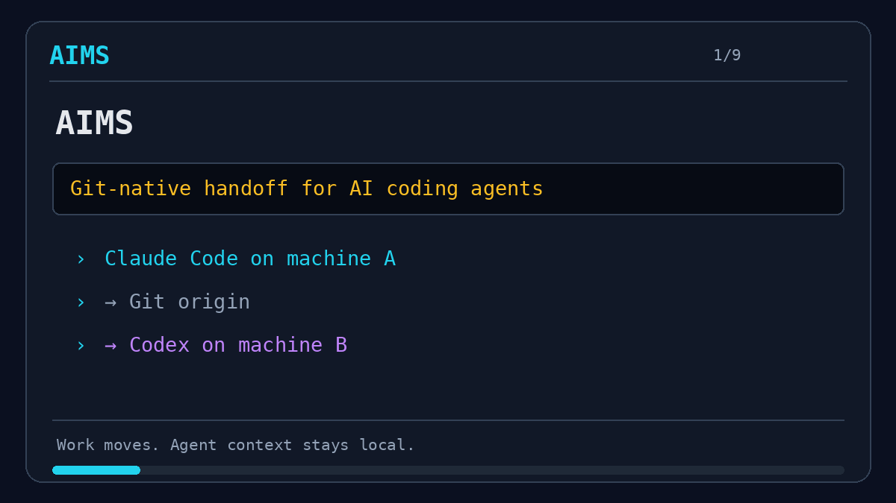

# AIMS

**AI Multi-agent Sessions** — git-native session management for AI coding agents,
across many machines and many agents.

  [](https://github.com/visaroy/aims/actions/workflows/ci.yml)   

AIMS turns each unit of AI work into a **git branch in an isolated worktree**. Sessions can be
**handed off** between machines and **adopted** by any agent — because the source of truth is a
git remote (`origin`), never a machine-to-machine link. No agent needs access to another's computer.

**You never learn AIMS commands.** Your agent does. You talk to it normally — *"save and close the
session"*, *"hand this off to the other machine"* — and it runs AIMS for you.

## Stable release

`v1.0.0` is the stable AIMS `1.0` command-line contract, verified through CI and an independent
Ubuntu installation. See the [CLI compatibility policy](docs/COMPATIBILITY.md) and the
[acceptance test](docs/TESTING.md).

## Agent-to-agent handoff

[](docs/TESTING.md)

The demo shows the verified lifecycle: `start` → `save` → `handoff` → `adopt` → `save` → `publish`.
Run the same workflow safely with disposable local repositories using the
[under-3-minute acceptance test](docs/TESTING.md).

---

## 🤖 Instructions for Your Agent

> [!TIP]
> **Don't install AIMS by hand — hand this to your agent.** Copy the prompt below to your AI coding
> agent (Claude Code, Codex CLI, opencode, or Gemini CLI) and it will review and install AIMS for you.

```text
Install AIMS from its official public repository: https://github.com/visaroy/aims

1. Review it first. Read README.md, SECURITY.md, and LICENSE, and skim bootstrap.sh,
   install.sh, and lib/. Confirm for me that it: makes no network calls except `git` to
   repositories I configure, ships no secrets or telemetry, needs no elevated privileges,
   and backs up any file it modifies. Summarize the security posture before installing.

2. Install it (this accepts the MIT license and its "AS IS", no-warranty terms on my behalf):
     curl -fsSL https://raw.githubusercontent.com/visaroy/aims/main/bootstrap.sh | AIMS_ACCEPT=1 bash
   The installer links the `aims` command, creates my private data repo at ~/.aims, and adds an
   AIMS rules block to the config of each AI agent it detects — backing up each original first.

3. Give my data repo a remote so sessions sync across machines, then verify. Ask me for the URL
   of a private git repo I control (create one if I don't have it), then run:
     git -C ~/.aims remote add origin <MY_PRIVATE_DATA_REPO_URL>
     git -C ~/.aims push -u origin main
     aims doctor
   Also add `export AIMS_HOME=$HOME/.aims` to my shell profile.

4. Report what you reviewed, the security summary, which agent config files were changed (and
   where the backups are), and the final `aims doctor` output.

To restore/update AIMS later, run `cd ~/aims && bash install.sh`: it prints `🔄 Restoring a fresh, official AIMS version from the official GitHub repository…`, fetches `origin/main`, then runs `git reset --hard origin/main` and `git clean -ffdx` before refreshing the command link. It deliberately deletes every local tracked, untracked, and ignored engine file (including nested worktrees such as `.slim/`) so `~/aims` is an exact official checkout; it still refuses a non-`main` branch.
```

Running this on more than one machine, each pointed at the **same** private data repo, is the whole
multi-machine setup — the machines meet only on that remote, never on each other.

---

## Why

Running AI agents (Claude, Codex, opencode, Gemini) across a laptop and a workstation creates the
same problems every time: work stranded on one machine, two agents clobbering each other, "done"
that never reached the shared repo, and no clean way to pick up someone else's half-finished task.

AIMS solves this the boring, durable way: **plain git**. Branches, worktrees, and a small set of
scripts with guards that make the failure modes loud instead of silent.

## Model

Two layers, deliberately separated:

| Layer | What | Portable? |
|---|---|---|
| **Work** | branch `ai/<session-id>`, worktree, session files, commits | ✅ yes — via `origin` |
| **Agent context** | an agent's live reasoning/transcript | ❌ no — stays local |

You continue a session from **artifacts** (worklog + commits), never from the previous agent's head.
That is what makes it agent-agnostic and machine-agnostic.

## AIMS vs. a tool's own "resume"

Every AI CLI has a native resume (`claude --resume`, `codex resume`, `gemini --resume`, opencode's
session continue). They all move the **conversation** within **one tool** on **one machine**. AIMS
moves the **work** across machines and across tools:

| | `claude --resume` | `aims adopt` |
|---|---|---|
| What it moves | ✅ full agent context | ✅ work artifacts (git) |
| Scope | ⚠️ same machine, Claude only | ✅ any machine, any agent (claude, codex, opencode, gemini) |
| Medium | ⚠️ local `.jsonl` (not synced) | ✅ branch on `origin` |
| codex / opencode / gemini | ❌ N/A | ✅ works |

Full breakdown across all tools: [`docs/COMPARISON.md`](docs/COMPARISON.md). A focused comparison with Softaworks Agent Toolkit's session-handoff skill: [`docs/SESSION-HANDOFF-COMPARISON.md`](docs/SESSION-HANDOFF-COMPARISON.md).

---

## Install

Setup has two sides: the **agent environment** (the CLIs you talk to) and, optionally, a **hardware /
storage environment** (a shared network store for large files). After setup you interact only with
your agent in natural language — AIMS runs underneath.

### 1. Prepare the agent environment

Install whichever agent CLIs you use — any mix works:
[Claude Code](https://claude.com/claude-code), [OpenAI Codex CLI](https://github.com/openai/codex),
[opencode](https://opencode.ai), [Gemini CLI](https://github.com/google-gemini/gemini-cli).
Also need `git`, `bash`, `python3` (macOS or Linux).

### 2. One-command setup

```bash
curl -fsSL https://raw.githubusercontent.com/visaroy/aims/main/bootstrap.sh | bash
```

This: installs the engine to `~/aims`, links the `aims` command, creates your private data repo
(`~/.aims`), and **teaches every installed agent to understand AIMS** by writing an AIMS rules block
into their config files (`~/AGENTS.md`, `~/.codex/AGENTS.md`, `~/.claude/CLAUDE.md`, `~/.gemini/GEMINI.md`).
For a later engine restore/update, run `cd ~/aims && bash install.sh`: it announces the official-repository restore, fetches `origin/main`, then uses `git reset --hard origin/main` plus `git clean -ffdx` before refreshing the link. This deliberately removes local tracked, untracked, and ignored files — including nested worktrees such as `.slim/` — so `~/aims` is exactly the official engine; it refuses only a non-`main` branch.

Then point AIMS at your data repo and give it a remote so sessions sync across machines:

```bash
echo 'export AIMS_HOME=$HOME/.aims' >> ~/.bashrc   # or ~/.zshenv
git -C ~/.aims remote add origin <your-private-data-repo-url>
git -C ~/.aims push -u origin main
aims doctor
```

### 3. (Optional) shared storage for large files

Git holds session pointers; a shared network store holds the bytes (build outputs, dumps, datasets).
Point `AIMS_ARTIFACTS` at a mounted store and pick any backend — **NFS, SMB/Samba, GlusterFS, CephFS,
MinIO, RustFS, Ceph RGW**. Copy-paste recipes: [`docs/SHARED-STORE.md`](docs/SHARED-STORE.md).

```bash
echo 'export AIMS_ARTIFACTS=$HOME/.aims-artifacts' >> ~/.bashrc   # mount point of the shared store
```

### 4. Each additional machine

Run step 2 on every machine and point them at the **same** `origin` data repo. That is the whole
multi-machine setup — no machine ever connects to another; they meet on `origin`.

### That's it — now just talk to your agent

You do **not** memorize `aims start` / `aims save` / etc. Say what you want; the agent maps it:

> "start on the login bug" · "save the session" · "hand this off to the laptop" ·
> "continue session 2026…-login-fix" · "save and close the session"

---

## Reference (for agents, not users)

> The commands below are what your **agent** runs after interpreting your intent. You never type them.
> They are documented so agents — and the curious — know exactly what happens.

```bash
aims start myproject "fix login bug" claude    # new branch + worktree
cd ~/.aims/.worktrees/<session-id>             # agent works here
aims save                                       # checkpoint: commit whole worktree + push
aims rebase <session-id>                         # safe rebase after a publish merge conflict
aims handoff "waiting on CI"                     # hand to another machine (pushes everything)
# Or, from ~/.aims/.worktrees: aims handoff <session-id>
aims adopt <session-id>                          # (elsewhere) take it over from origin
aims publish <session-id>                        # merge to main, register, done
```

| Command | Purpose |
|---|---|
| `aims init [dir]` | Scaffold a data repo |
| `aims start <proj> <topic> [agent] [--scope ...] [--continues-from <id>]` | Start a session |
| `aims save` | Scan tracked/untracked work, then commit the whole worktree + push |
| `aims rebase <id>` | Rebase a synchronized clean session onto `origin/main`; checkpoint the rewrite safely |
| `aims handoff [note]` | Secret-scan, checkpoint, and hand the session to another machine/agent |
| `aims handoff check <id>` | Check handoff readiness without changing session state |
| `aims handoff <session-id>` | Hand off one local session from `.worktrees/` |
| `aims handoff-all [--yes]` | Hand off all valid local worktrees |
| `aims checkpoint <id>\|--all` | Commit and push local sessions without handoff |
| `aims brief <id>` | Create an optional concise handoff brief |
| `aims adopt <id> [--remote]` | Take over a session from origin |
| `aims publish <id>` | Merge to main, append registry, delete branch |
| `aims list [--handoff] [--stale] [--project <project>]` | List and filter active sessions |
| `aims artifacts <id>` | Session dir in the shared store (`AIMS_ARTIFACTS`) |
| `aims wire-agents` | (Re)write the AIMS rules into agent config files |
| `aims install-hooks` | Reinstall the data repo pre-push guard |
| `aims doctor` | Health-check engine + data repo |
| `aims preflight [mode]` | Report whether the current Git repo is ready for an AIMS session |
| `aims version`, `aims help` | Print the version or public CLI contract |

See [`docs/COMMANDS.md`](docs/COMMANDS.md), [`docs/ARCHITECTURE.md`](docs/ARCHITECTURE.md),
[`docs/AIMS.md`](docs/AIMS.md), [`docs/AGENTS-MEMORY.md`](docs/AGENTS-MEMORY.md), and the
[agent integration strategy](docs/AGENT-INTEGRATION-STRATEGY.md). Also see the
[acceptance test](docs/TESTING.md), [CLI compatibility policy](docs/COMPATIBILITY.md), and the
[session handoff roadmap](docs/TODO.md).
**Documentation language:** English is official; translations under
[`docs/i18n/`](docs/i18n/).

## Guarantees & guards

- **No silent data loss**: `aims save` stages the *whole* worktree and always pushes when ahead;
  `aims publish` refuses a dirty or unpushed worktree and warns on an empty merge.
- **Safe rewritten checkpoints**: only `aims rebase` creates the private exact-OID rewrite marker;
  `aims save` uses `--force-with-lease` only when the remote still has that exact captured OID.
- **Concurrent writers are preserved**: a remote advance, deleted branch, stale marker, or unmarked
  divergence is refused rather than force-pushed.
- **Publication state is centralized**: start, save, rebase, handoff, and adopt maintain the local
  `refs/aims/published/<id>` sentinel; adoption push failures are fatal and retain the worktree.
- **Every branch update is leased**: existing branches use the exact fetched OID, while initial branch
  creation requires remote absence and a zero-OID lease.
- **Pre-existing divergence is refused**: handoff and adopt require the fetched remote tip to be an
  ancestor of local `HEAD` before checkpointing or applying an exact lease.
- **Adoption targets are exact**: adopt edits and pushes only a worktree on `ai/<session-id>` and checks
  the observed remote OID against that exact local branch/`HEAD`, including stale-branch recovery.
- **Force-policy recovery is supported**: save rebased `HEAD` at `refs/aims/recovery/<id>`, reset to
  `refs/aims/rewrite/<id>`, merge `origin/main` without committing, restore the recovery tree, commit,
  then save; delete the recovery ref only after success so actual conflict work is preserved.
- **No two-writer conflict**: `aims adopt` warns if a branch moved recently; `aims handoff` marks
  a session released so adoption elsewhere is known-safe.
- **`main` is protected**: a `pre-push` hook blocks direct pushes; integration only via `aims publish`.
- **No secrets, no external calls**: the engine talks only to your `origin`. See [`SECURITY.md`](SECURITY.md).

## Requirements

`git`, `bash`, `python3`. macOS and Linux.

## License

MIT — see [`LICENSE`](LICENSE).
